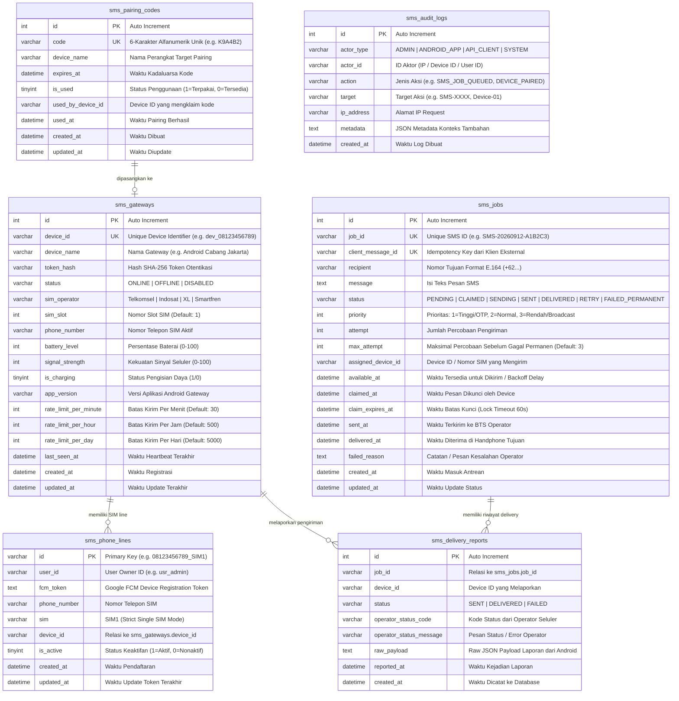
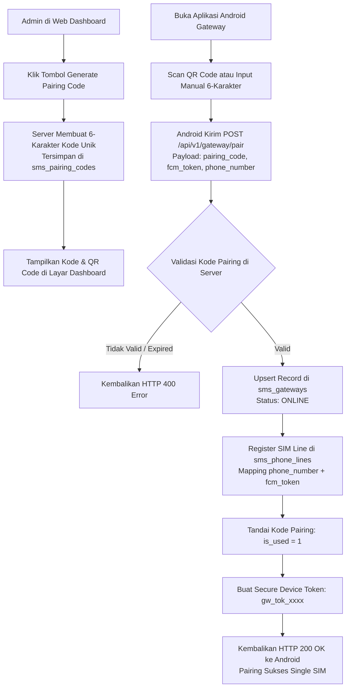
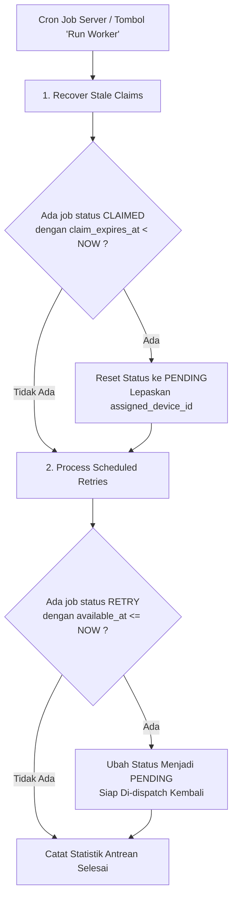
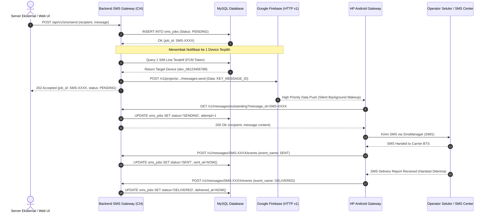

# SMS Gateway Backend — Dokumentasi Lengkap, ERD & Alur Kerja Sistem

Dokumentasi komprehensif arsitektur, **Entity Relationship Diagram (ERD)**, **Flowchart Alur Sistem**, panduan konfigurasi database (MySQL / SQLite), serta referensi **REST API** untuk sistem **SMS Gateway Backend** berbasis **CodeIgniter 4**, **Google Firebase Cloud Messaging (FCM HTTP v1)**, **Server-Sent Events (SSE)**, **WebSocket**, dan aplikasi **Android Gateway Client** (`com.httpsms` / `com.sevanam.androidsmsgateway`).

---

## Daftar Isi

1. [Arsitektur Sistem & Desain Modular](#1-arsitektur-sistem--desain-modular)
2. [Entity Relationship Diagram (ERD)](#2-entity-relationship-diagram-erd)
3. [Flowchart & Sequence Diagram Alur Kerja](#3-flowchart--sequence-diagram-alur-kerja)
   - [A. Flowchart Alur Pengiriman SMS End-to-End](#a-flowchart-alur-pengiriman-sms-end-to-end)
   - [B. Flowchart Pairing Perangkat Android](#b-flowchart-pairing-perangkat-android)
   - [C. Flowchart Queue Maintenance & Retry Backoff](#c-flowchart-queue-maintenance--retry-backoff)
   - [D. Sequence Diagram Pengiriman SMS via FCM HTTP v1](#d-sequence-diagram-pengiriman-sms-via-fcm-http-v1)
4. [Struktur Controller & Namespace Modular](#4-struktur-controller--namespace-modular)
5. [Spesifikasi Teknis & Persyaratan Server](#5-spesifikasi-teknis--persyaratan-server)
6. [Panduan Instalasi & Konfigurasi Database (MySQL / SQLite)](#6-panduan-instalasi--konfigurasi-database-mysql--sqlite)
7. [Tiga (3) Metode Komunikasi Dispatcher (`.env`)](#7-tiga-3-metode-komunikasi-dispatcher-env)
8. [Setup Firebase Cloud Messaging (FCM HTTP v1)](#8-setup-firebase-cloud-messaging-fcm-http-v1)
9. [Dokumentasi Lengkap REST API](#9-dokumentasi-lengkap-rest-api)
   - [A. Internal API (Untuk Aplikasi Backend / Microservices)](#a-internal-api-untuk-aplikasi-backend--microservices)
   - [B. Mobile Gateway API (Kontrak com.httpsms)](#b-mobile-gateway-api-kontrak-comhttpsms)
   - [C. Hardware & Custom Gateway Protocol API](#c-hardware--custom-gateway-protocol-api)
10. [Contoh Kode Integrasi Klien (PHP, Node.js, Python, cURL)](#10-contoh-kode-integrasi-klien-php-nodejs-python-curl)
11. [Web Dashboard & Monitoring Interaktif](#11-web-dashboard--monitoring-interaktif)
12. [Troubleshooting & Solusi Error Umum](#12-troubleshooting--solusi-error-umum)

---

## 1. Arsitektur Sistem & Desain Modular

Sistem SMS Gateway bertindak sebagai **Transactional SMS Router** yang menjembatani aplikasi backend eksternal (Website, ERP, POS, CRM, E-Commerce) dengan perangkat Android fisik yang memiliki kartu SIM seluler aktif.

```mermaid
graph TB
    subgraph ClientServices [Aplikasi & Layanan Luar]
        WebApps["Website / E-Commerce"]
        BackendAPI["Laravel / Node.js / Python API"]
        AdminDashboard["Web Dashboard Admin"]
    end

    subgraph CoreBackend [SMS Gateway Engine - CodeIgniter 4]
        Router["CodeIgniter 4 Routes & Filters"]
        
        subgraph Controllers [Modular Controllers]
            WebCtrl["Web/DashboardController"]
            IntCtrl["Internal/InternalSmsController"]
            MobCtrl["Mobile/MobileApiController"]
            GwyCtrl["Gateway/GatewayApiController"]
        end
        
        Dispatcher["SmsDispatcher (Router Logika Dispatch)"]
        JobQueue[("Database MySQL / SQLite\n(sms_jobs queue)")]
    end

    subgraph CommunicationChannels [Kanal Komunikasi Real-Time]
        FCM["Google Firebase Cloud Messaging (HTTP v1)"]
        SSE["Server-Sent Events (SSE Stream)"]
        WS["WebSocket Real-Time Daemon"]
    end

    subgraph AndroidDevices [Perangkat Android SIM Gateway]
        Android1["HP Android Gateway 01\n(Telkomsel SIM1)"]
        Android2["HP Android Gateway 02\n(Indosat SIM1)"]
    end

    subgraph TelecomNetwork [Jaringan Operator Seluler]
        BTS["Tower BTS Seluler (GSM/LTE)"]
        CustomerHandset["HP Penerima SMS / Pelanggan (SMS OTP/Notifikasi)"]
    end

    ClientServices -->|POST /api/v1/sms/send| Router
    AdminDashboard -->|Web UI Actions| WebCtrl
    Router --> Controllers
    IntCtrl --> JobQueue
    JobQueue --> Dispatcher
    
    Dispatcher -->|Push Notification| FCM
    Dispatcher -->|Event Stream| SSE
    Dispatcher -->|WebSocket Broadcast| WS
    
    FCM -->|Silent Wakeup| Android1
    SSE -->|Stream Job| Android1
    WS -->|Instant Event| Android1
    
    Android1 -->|GET /v1/messages/outstanding| MobCtrl
    Android1 -->|Kirim SMS Pulsa Seluler| BTS
    BTS --> CustomerHandset
    Android1 -->|POST /v1/messages/events (SENT/DELIVERED)| MobCtrl
```

---

## 2. Entity Relationship Diagram (ERD)

Database dirancang dengan skema relasional yang fleksibel, mendukung integritas idempotency, pencatatan log audit menyeluruh, dan pelacakan status pengiriman per perangkat:



---

## 3. Flowchart & Sequence Diagram Alur Kerja

### A. Flowchart Alur Pengiriman SMS End-to-End

```mermaid
flowchart TD
    Start([Klien Mengirim Request Kirim SMS]) --> CheckIdempotency{Apakah client_message_id<br/>sudah pernah ada di database?}
    
    CheckIdempotency -- Ya (Duplikat) --> ReturnReplay[Kembalikan Data Job yang Sudah Ada<br/>HTTP 200 Idempotent]
    CheckIdempotency -- Tidak (Pesan Baru) --> InsertJob[Simpan ke Tabel sms_jobs<br/>Status: PENDING, Attempt: 0]
    
    InsertJob --> CheckDispatchConfig{Cek Konfigurasi .env<br/>Metode Pengiriman Aktif}
    
    CheckDispatchConfig -- USE_FIREBASE=true --> SelectTarget[Pilih 1 Device / SIM Line Aktif<br/>(Bukan Broadcast)]
    SelectTarget --> TriggerFCM[Tembak Push Data FCM v1<br/>Payload: KEY_MESSAGE_ID]
    TriggerFCM --> AndroidWakeup[Android Menerima Silent Push FCM]
    
    CheckDispatchConfig -- USE_SSE=true --> PushSSE[Kirim Event new_sms_job<br/>via HTTP SSE Stream]
    PushSSE --> AndroidWakeup
    
    CheckDispatchConfig -- USE_WEBSOCKET=true --> BroadcastWS[Kirim Pesan JSON via WebSocket]
    BroadcastWS --> AndroidWakeup
    
    AndroidWakeup --> FetchJob[Android Request:<br/>GET /v1/messages/outstanding]
    FetchJob --> LockJob[Server Tandai:<br/>Status: SENDING, Attempt: 1<br/>Assigned Device: dev_xxx]
    
    LockJob --> AndroidSendSMS[Android Memanggil SmsManager.sendTextMessage<br/>Mengirim Pulsa GSM via SIM1]
    
    AndroidSendSMS --> SentRadio{Apakah Radio BTS Menerima?}
    SentRadio -- Sukses --> ReportSent[Android Kirim Event SENT:<br/>POST /v1/messages/:id/events]
    ReportSent --> UpdateSent[Server Update Status: SENT<br/>Simpan ke Delivery Report]
    
    SentRadio -- Gagal --> ReportFailed[Android Kirim Event FAILED]
    ReportFailed --> RetryLogic{Attempt < Max Attempt?}
    RetryLogic -- Ya --> SetRetry[Server Set Status: RETRY<br/>Backoff Delay: 30s/5m/15m]
    RetryLogic -- Tidak --> SetFailedPerm[Server Set Status: FAILED_PERMANENT]
    
    UpdateSent --> HandsetDelivered{Apakah HP Tujuan Menerima SMS?<br/>Delivery PDU}
    HandsetDelivered -- Ya --> ReportDelivered[Android Kirim Event DELIVERED]
    ReportDelivered --> UpdateDelivered[Server Update Status: DELIVERED]
    HandsetDelivered -- Tidak / Kadaluarsa --> EndNode([Selesai])
    UpdateDelivered --> EndNode
    ReturnReplay --> EndNode
    SetFailedPerm --> EndNode
```

---

### B. Flowchart Pairing Perangkat Android



---

### C. Flowchart Queue Maintenance & Retry Backoff



---

### D. Sequence Diagram Pengiriman SMS via FCM HTTP v1



---

## 4. Struktur Controller & Namespace Modular

Kode backend ditata secara modular ke dalam sub-namespace terpisah di dalam `app/Controllers/`:

```text
app/Controllers/
├── BaseController.php
│
├── Web/                                # 1. Domain Web Dashboard & Admin UI
│   └── DashboardController.php         # Render UI, Polling Data, Test SMS, Worker, Device Actions
│
├── Mobile/                             # 2. Domain Android Mobile App Client (com.httpsms)
│   └── MobileApiController.php         # Register FCM Token, Polling Outstanding Job, Heartbeat, Event
│
├── Internal/                           # 3. Domain Internal Backend / Microservices API
│   └── InternalSmsController.php       # Enqueue SMS (/sms/send), Cek Status SMS, Statistik Antrean
│
├── Gateway/                            # 4. Domain Dedicated Hardware / Custom Gateway Device
│   └── GatewayApiController.php        # Handshake Pairing, SSE Stream, Atomic Job Claim, Delivery Report
│
└── Api/                                # (Backward Compatibility Wrappers untuk integrasi lama)
    ├── HttpSmsController.php           # Extend MobileApiController
    ├── SmsApiController.php            # Extend InternalSmsController
    └── GatewayApiController.php        # Extend GatewayApiController
```

---

## 5. Spesifikasi Teknis & Persyaratan Server

| Komponen | Kebutuhan Minimum | Rekomendasi Produksi |
| :--- | :--- | :--- |
| **Bahasa & Runtime** | PHP 8.1 / 8.2 / 8.3 / 8.4 | PHP 8.2+ dengan ekstensi `curl`, `json`, `mbstring`, `openssl`, `mysqli` |
| **Web Server** | Apache / LiteSpeed / Nginx | Nginx / LiteSpeed dengan SSL/TLS aktif (HTTPS) |
| **Database** | SQLite 3 | **MySQL 8.0+ / MariaDB 10.6+** |
| **Protokol Push** | Firebase Cloud Messaging HTTP v1 | Google Service Account OAuth2 (RS256 JWT) |
| **Kebijakan SIM** | Single SIM Mode | 1 Nomor Provider GSM & 1 Slot SIM per HP Android |

---

## 6. Panduan Instalasi & Konfigurasi Database (MySQL / SQLite)

### A. Konfigurasi Menggunakan MySQL (Disarankan untuk Produksi)

Buka file `.env` di root project dan sesuaikan bagian database:

```ini
#--------------------------------------------------------------------
# DATABASE CONFIGURATION (MYSQL)
#--------------------------------------------------------------------
database.default.hostname = localhost
database.default.database = nama_database_sms
database.default.username = user_database_sms
database.default.password = password_database_anda
database.default.DBDriver = MySQLi
database.default.DBPrefix =
database.default.port     = 3306
database.default.charset  = utf8mb4
database.default.DBCollat = utf8mb4_general_ci
```

Jalankan perintah migrasi tabel:
```bash
php spark migrate
```

---

### B. Konfigurasi Menggunakan SQLite

Jika menggunakan SQLite tanpa perlu setup database MySQL:

```ini
database.default.DBDriver = SQLite3
database.default.database = WRITEPATH . 'sms_gateway.db'
```

---

## 7. Tiga (3) Metode Komunikasi Dispatcher (`.env`)

Sistem mendukung 3 metode pengiriman sinyal ke Android yang dapat diatur cukup dengan `true` / `false` di `.env`:

```ini
#--------------------------------------------------------------------
# SMS DISPATCH METHODS (PILIH METODE PENGIRIMAN KE ANDROID)
#--------------------------------------------------------------------
USE_FIREBASE  = true     # Metode 1: Firebase Cloud Messaging (FCM HTTP v1)
USE_SSE       = false    # Metode 2: Server-Sent Events (SSE Stream via HTTP)
USE_WEBSOCKET = false    # Metode 3: WebSocket Real-Time Daemon
```

---

## 8. Setup Firebase Cloud Messaging (FCM HTTP v1)

1. Buka [Google Firebase Console](https://console.firebase.google.com/).
2. Masuk ke **Project Settings** > **Service Accounts**.
3. Klik tombol **Generate new private key** (akan mengunduh file JSON).
4. Simpan file JSON tersebut ke direktori server:
   ```text
   writable/firebase/service-account.json
   ```
5. Pastikan konfigurasi di `.env` sudah mengarah ke file tersebut:
   ```ini
   fcm.credentialsFile = 'writable/firebase/service-account.json'
   ```

---

## 9. Dokumentasi Lengkap REST API

### A. Internal API (Untuk Aplikasi Backend / Microservices)

Semua endpoint dilindungi oleh header `x-api-key`.

#### 1. Enqueue / Kirim SMS
- **URL**: `POST /api/v1/sms/send`
- **Headers**:
  ```http
  x-api-key: sms_secret_api_key_2026
  Content-Type: application/json
  ```
- **Body JSON**:
  ```json
  {
    "recipient": "+6281234567890",
    "message": "Kode OTP Anda adalah 849201. Berlaku selama 5 menit.",
    "priority": 1,
    "client_message_id": "ORDER-98214-OTP",
    "max_attempt": 3
  }
  ```
- **Response Sukses (HTTP 202 Accepted)**:
  ```json
  {
    "status": "success",
    "message": "SMS job queued successfully",
    "data": {
      "job_id": "SMS-20260912140000-A1B2C3",
      "client_message_id": "ORDER-98214-OTP",
      "recipient": "+6281234567890",
      "status": "PENDING",
      "priority": 1,
      "attempt": 0,
      "is_replay": false,
      "created_at": "2026-09-12 14:00:00"
    }
  }
  ```

#### 2. Cek Status Pengiriman SMS
- **URL**: `GET /api/v1/sms/status/{job_id_atau_client_message_id}`
- **Headers**: `x-api-key: sms_secret_api_key_2026`
- **Response Sukses (HTTP 200 OK)**:
  ```json
  {
    "status": "success",
    "data": {
      "job_id": "SMS-20260912140000-A1B2C3",
      "client_message_id": "ORDER-98214-OTP",
      "recipient": "+6281234567890",
      "message": "Kode OTP Anda adalah 849201...",
      "status": "DELIVERED",
      "priority": 1,
      "attempt": 1,
      "assigned_device_id": "dev_081234567890",
      "sent_at": "2026-09-12 14:00:02",
      "delivered_at": "2026-09-12 14:00:06"
    }
  }
  ```

#### 3. Statistik Antrean SMS
- **URL**: `GET /api/v1/sms/statistics`
- **Headers**: `x-api-key: sms_secret_api_key_2026`

---

### B. Mobile Gateway API (Kontrak com.httpsms)

Endpoint yang dipanggil otomatis oleh aplikasi Android Gateway.

#### 1. Registrasi / Refresh Token FCM
- **URL**: `PUT /v1/phones/fcm-token`
- **Headers**: `x-api-key: sms_secret_api_key_2026`
- **Body JSON**:
  ```json
  {
    "fcm_token": "eXample_FcmToken_LongString...",
    "phone_number": "+6281234567890",
    "sim": "SIM1"
  }
  ```

#### 2. Ambil Pesan yang Perlu Dikirim
- **URL**: `GET /v1/messages/outstanding?message_id=SMS-XXXX`
- **Headers**: `x-api-key: sms_secret_api_key_2026`

#### 3. Laporan Status Pengiriman Event
- **URL**: `POST /v1/messages/{messageId}/events`
- **Headers**: `x-api-key: sms_secret_api_key_2026`
- **Body JSON**:
  ```json
  {
    "event_name": "DELIVERED",
    "reason": null,
    "timestamp": "2026-09-12T14:00:06Z"
  }
  ```

#### 4. Heartbeat Perangkat Android
- **URL**: `POST /v1/heartbeats`
- **Headers**: `x-api-key: sms_secret_api_key_2026`
- **Body JSON**:
  ```json
  {
    "device_id": "dev_081234567890",
    "phone_numbers": ["+6281234567890"],
    "battery_level": 88,
    "is_charging": true,
    "sim_carrier": "TELKOMSEL"
  }
  ```

---

## 10. Contoh Kode Integrasi Klien (PHP, Node.js, Python, cURL)

### PHP (Laravel / GuzzleHttp)
```php
use Illuminate\Support\Facades\Http;

$response = Http::withHeaders([
    'x-api-key' => env('SMS_GATEWAY_API_KEY', 'sms_secret_api_key_2026'),
])->post('https://your-domain.com/api/v1/sms/send', [
    'recipient'         => '+6281234567890',
    'message'           => 'Halo! Pesanan #INV-1029 berhasil diverifikasi.',
    'priority'          => 1,
    'client_message_id' => 'INV-1029-PAID',
]);

$result = $response->json();
echo "Job ID: " . $result['data']['job_id'];
```

### Node.js (Axios)
```javascript
const axios = require('axios');

async function sendSmsOtp(phone, otpCode) {
    const res = await axios.post('https://your-domain.com/api/v1/sms/send', {
        recipient: phone,
        message: `Kode verifikasi akun Anda: ${otpCode}. Rahasiakan kode ini.`,
        priority: 1,
        client_message_id: `OTP-${Date.now()}`
    }, {
        headers: { 'x-api-key': 'sms_secret_api_key_2026' }
    });
    console.log('SMS Dispatched:', res.data.data.job_id);
}
```

### Python (Requests)
```python
import requests

url = "https://your-domain.com/api/v1/sms/send"
headers = {"x-api-key": "sms_secret_api_key_2026"}
payload = {
    "recipient": "+6281234567890",
    "message": "Pemberitahuan: Layanan Anda aktif hingga 30 hari ke depan.",
    "priority": 2
}

res = requests.post(url, json=payload, headers=headers)
print(res.json())
```

### cURL (Terminal / Bash Script)
```bash
curl -X POST "https://your-domain.com/api/v1/sms/send" \
     -H "Content-Type: application/json" \
     -H "x-api-key: sms_secret_api_key_2026" \
     -d '{
       "recipient": "+6281234567890",
       "message": "Test SMS Gateway via cURL",
       "priority": 1
     }'
```

---

## 11. Web Dashboard & Monitoring Interaktif

Akses Dashboard di browser: `https://your-domain.com/`

**Fitur Dashboard**:
1. **Status Dispatcher & FCM Live**: Menampilkan metode aktif (`USE_FIREBASE=true`, `USE_SSE=true`, dll).
2. **Statistik Antrean Real-Time**: Total SMS, Delivered, Pending, Sending, dan SIM lines terdaftar.
3. **Generator Kode Pairing & QR Code**: Mempermudah proses koneksi HP Android tanpa input manual.
4. **Interactive Test SMS Sender**: Fitur uji coba kirim SMS langsung dari browser lengkap dengan preset OTP & Notifikasi.
5. **Aksi Perangkat**: Enable, Disable, Revoke Token, dan Hapus Perangkat.
6. **Kirim Ulang (Requeue)**: Reset status SMS ke PENDING dan otomatis menembakkan sinyal push ulang ke Android.
7. **Tombol 'Run Worker'**: Membersihkan *stale claimed jobs* dan melepaskan antrean retry secara manual.

---

## 12. Troubleshooting & Solusi Error Umum

| Masalah / Error | Kemungkinan Penyebab | Solusi |
| :--- | :--- | :--- |
| **HTTP 401 Unauthorized** | `x-api-key` salah atau tidak dikirimkan di header. | Pastikan header `x-api-key` sesuai dengan nilai `app.smsApiKey` pada `.env`. |
| **FCM: Service Account Not Found** | File JSON kredensial Firebase belum ditaruh di folder `writable/firebase/`. | Unduh *Service Account Private Key* dari Firebase Console dan simpan ke `writable/firebase/service-account.json`. |
| **SMS Tertahan di Status PENDING** | Tidak ada HP Android yang online atau FCM token belum terdaftar. | Buka aplikasi Android Gateway, pastikan HP memiliki koneksi internet dan terdaftar di tab **SIM Lines & FCM**. |
| **Device Muncul Duplikat** | Device ID berganti saat update token. | Sistem kini otomatis melakukan deduplikasi berdasarkan `phone_number`. Lakukan revoke dan pairing ulang jika diperlukan. |
| **Database Connection Refused** | Konfigurasi MySQL di `.env` belum sesuai atau port tertutup. | Periksa host, username, password, dan nama database di `.env`, lalu pastikan service MySQL berjalan (`sudo systemctl status mysql`). |

---

*Dokumentasi ini dikelola secara berkala untuk rilis v2.0.*
